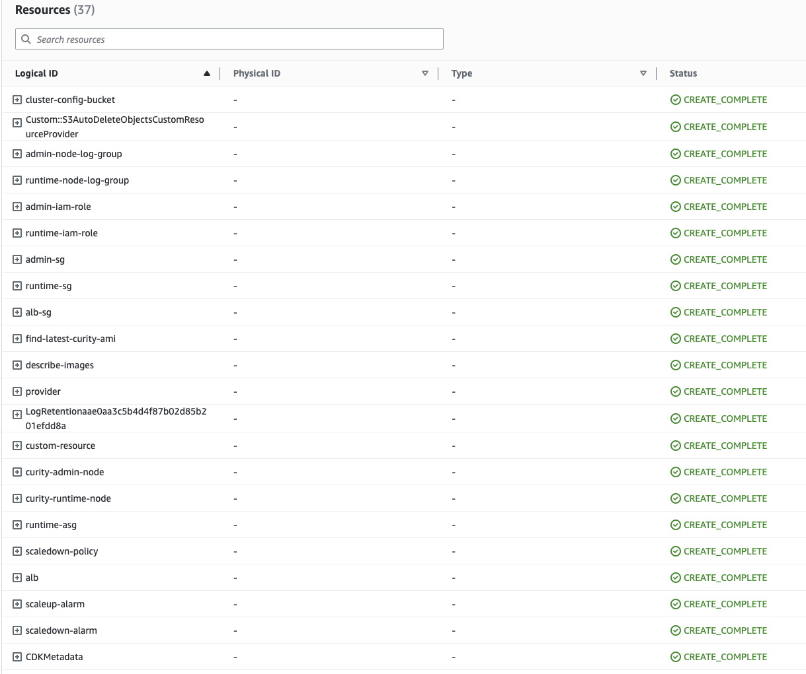

# Curity Identity Server AWS CDK Project

[](https://curity.io/resources/code-examples/status/)
[](https://curity.io/resources/code-examples/status/)

This aws cdk project deploys a basic load balanced EC2 deployment of the Curity Identity Server, with an in-memory
HSQL database, to demonstrate how to manage cloud resources using the CDK. The Curity Identity Server cluster is deployed in a [Standalone Admin setup](https://curity.io/docs/idsvr/latest/system-admin-guide/deployment/clustering.html#standalone-admin-setup) using a cluster configuration which is auto-generated during the deployment process.


# Prepare the Installation

Installing using `aws cdk` has the following prerequisites:

- [AWS Account](https://aws.amazon.com/premiumsupport/knowledge-center/create-and-activate-aws-account/)
- [AWS CLI](https://docs.aws.amazon.com/cli/latest/userguide/getting-started-install.html) installed and configured.
- [NodeJS & npm](https://docs.npmjs.com/downloading-and-installing-node-js-and-npm) installed. AWS CDK applications require Node.js 10.13 or later (*Node.js versions 13.0.0 through 13.6.0 are not compatible with the AWS CDK due to compatibility issues with its dependencies*)
- [Typescript](https://www.npmjs.com/package/typescript)
- [AWS CDK v2](https://aws.amazon.com/getting-started/guides/setup-cdk/module-two/)
- [EC2 key Pair](https://docs.aws.amazon.com/AWSEC2/latest/UserGuide/create-key-pairs.html)

## Configuration
This project provides configuration options via an `.env` file available in the root of the project.

Parameter | Description 
--- | --- 
`ADMIN_INSTANCE_TYPE` | The EC2 Instance type of the Admin node 
`RUNTIME_INSTANCE_TYPE` | The EC2 Instance type of the Runtime node(s) 
`RUNTIME_MIN_NODE_COUNT` | The minimum number of Runtime node(s) 
`RUNTIME_MAX_NODE_COUNT` | The maximum number of Runtime node(s) 
`AWS_EC2_KEY_PAIR_NAME` | The EC2 Key Pair to allow SSH access to the ec2 instances * 
`AWS_VPC_ID` | VpcId of an existing Virtual Private Cloud (VPC) 
`TRUSTED_IP_RANGE_CIDR` | The IP address range that can be used to SSH to the EC2 instances and access the Curity Admin UI 
`LOADBALANCER_IP_RANGE_CIDR` | The IP address range that can be used to access Curity Runtime service through the load balancer 
`AWS_CERTIFICATE_ARN` | The ARN of the certificate to be used by the load balancer *
`AWS_EFS_DNS` | The EFS DNS for the file system containing configuration, plugins and template/translation overrides. * 
`CLOUDWATCH_NAMESPACE` | The namespace for the metrics pushed to CloudWatch. If not set, the metrics will not be pushed to CloudWatch 
`ENABLE_CLOUDWATCH_LOGS` | Send application logs to cloudwatch
`METRICS_SCRAPE_INTERVAL_IN_SECONDS` | How often to scrape data from Curity's metrics endpoint
`RUNTIME_MAX_REQUESTS_PER_NODE` | The max threshold for the number of requests per runtime node. Exceeding this for 2 times in 5 minutes will scale up the number of runtime nodes by 1 
`RUNTIME_MIN_REQUESTS_PER_NODE` | The min threshold for the number of requests per runtime node. Staying under this limit for 5 consecutive minutes will scale down the number of runtime nodes by 1 
`ADMIN_PASSWORD` | Password for the admin user of the Curity configuration service 
`RUNTIME_SERVICE_ROLE` | The Runtime service roles 
`CONFIG_ENCRYPTION_KEY` | The key to encrypt the Curity Configuration

  \* This resource has to be created beforehand.

### Understanding the IP Ranges

There are two IP ranges configurable in the `.env` file, the `TRUSTED_IP_RANGE_CIDR` and `LOADBALANCER_IP_RANGE_CIDR`.

The `TRUSTED_IP_RANGE_CIDR` is used by the SecurityGroups assigned to the Admin and Runtime nodes to allow SSH access only from this IP range. It is also used for port 6749 so the administrators can have access to the Curity Admin UI. The Admin UI is exposed directly in the EC2 Instance, so in order to reach it you need to use the IP or DNS name of the EC2 Instance that runs the Admin Service. When a `CertificateArn` is configured, the Admin UI is instead exposed through the Load Balancer in the port 6749, while access to that port is still constraint to the `TrustedIpRange`

The `LOADBALANCER_IP_RANGE_CIDR` is the IP range that can access the Runtime Services through the Load Balancer. 

> **_NOTE:_** If there is no value provided for `LOADBALANCER_IP_RANGE_CIDR` and `TRUSTED_IP_RANGE_CIDR` in the `.env` file then the default for both IP ranges allows access from anywhere (i.e 0.0.0.0/0).

### Using a validated certificate

In AWS, the TLS certificates are managed in the [Certificate Manager](https://aws.amazon.com/certificate-manager/). When a verified certificate resource `arn` is configured in the variable `AWS_CERTIFICATE_ARN`, then the load balancer will listen to HTTPS traffic on port 443 and serve that certificate.

The same certificate will be used on the port 6749 which is only available through the Load Balancer if the `AWS_CERTIFICATE_ARN` is set in the `.env` file.

### Logs and Metrics

There are two different variables to control whether the logs and metrics are sent to AWS CloudWatch, `EnableCloudWatchLogs` and `CloudWatchNamespace` respectively. 

When `EnableCloudWatchLogs` is set to true, two `LogGroups` are created by the aws cdk, namely `curity-idsvr-adminnodeloggroupxxx..` and the `curity-idsvr-runtimenodeloggroupxxx..`. The logs are sent to CloudWatch Logs by a cloudwatch-agent that runs in the EC2 Instances.

When a `CloudWatchNamespace` is configured, the [metrics](https://developer.curity.io/docs/latest/system-admin-guide/monitoring/index.html#prometheus-compliant-metrics) from the Curity Identity server are sent to CloudWatch and are grouped for each EC2 Instance in the form `CloudWatchNamespace-InstanceId`. The setting `MetricsScrapeInterval` in the parameters defines the interval of the scraping of the metrics, in seconds.

### Using EFS for template for message overrides and plugins

[AWS EFS](https://aws.amazon.com/efs/) is a shared, elastic file storage system and it was chosen because it follows the traditional file system paradigm and can be mounted into multiple EC2 Instances. 
In order to enable this, an EFS Storage has to be created in advance. In that storage, you can use the following file structure to install template and message overrides, as well as plugins in your cluster.
```
├── messages
│.. ├── overrides
├── templates
│.. ├── overrides
│.. ├── template-areas
├── plugins
│.. ├── pluging-group1
│.. ├── plugin-group2
```

The EFS storage, when configured, is mounted into the `/data` folder in the all the EC2 Instances that run both the Admin and Runtime nodes. The Curity Identity Server is installed under the folder `/opt/idsvr` and there are already symlinks that point from the folders of the server to the mounted EFS storage. 

```
/opt/idsvr/usr/share/messages/overrides -> /data/messages/overrides
/opt/idsvr/usr/share/templates/overrides -> /data/templates/overrides
/opt/idsvr/usr/share/templates/template-areas -> /data/templates/template-areas
/opt/idsvr/usr/share/plugins -> /data/plugins
```

Also, the first-run script of the Curity Identity Server will copy all files under `<EFS_MOUNT_POINT>/config/` into `/opt/idsvr/etc/init/`. This way the cluster can be initialized with configuration.

> **_NOTE:_** Do not include cluster configuration, or a file called cluster.xml in the `config` folder, as it will be overridden by the one generated during startup. 
## Installation

 1. Clone the repository
    ```sh
    git clone git@github.com:curityio/idsvr-aws-cdk.git
    cd idsvr-aws-cdk
    ```
 2. Install cdk dependencies
    ```sh
    npm install package.json
    npm --prefix lib/lambda install
    ```     
 3. Bootstrap the CDK  
    ```sh
    cdk bootstrap
    ``` 
 4. Deploy the Curity Identity Server in the connected AWS account

    Please make sure that the **AWS_PROFILE** environment variable is set in command line terminal (*export AWS_PROFILE=my-profile*) to the correct aws profile name.
   
    ```sh
    ./deploy-idsvr-aws-cdk.sh --install
    ```
 5. Few other useful commands
    ```sh
    - `cdk diff` compare deployed stack with current state
    - `cdk synth` emits the synthesized CloudFormation template 
    ```

## Installed Resources
Following resource are deployed to AWS by the cdk.

Installed Resources:
- An EC2 Instance for the Admin node
- A Launchtemplate for the Runtime node(s)
- An Autoscaling group for the Runtime nodes
- An lambda function for finding latest curity AMI
- An Application Load Balancer (ALB), and all related resources (listeners and target groups)
- IAM Roles and Profiles that are attached to the nodes
- SecurityGroups for Admin node, Runtime nodes and the ALB
- A S3 Bucket where the initial cluster configuration is stored
- LogGroups, if logging to CloudWatch is enabled
- Scaling Policies and Alarms, used for autoscaling




## Cleanup
Run `./deploy-idsvr-aws-cdk.sh --delete` to remove the installation. 

## Summary
The deployment returns two URLs pointing to the Admin node and the runtime respectively. Before accessing the runtime, please complete the [first run configuration](https://curity.io/resources/learn/first-config/)

```
Outputs:
IdsvrAwsCdkStack.curityadminuilb = https://curity-alb-662716172.eu-west-1.elb.amazonaws.com:6749/admin
IdsvrAwsCdkStack.curityruntimeopenidconfiguration = https://curity-alb-662716172.eu-west-1.elb.amazonaws.com/oauth/v2/oauth-anonymous/.well-known/openid-configuration

```

## More Information

Please visit [curity.io](https://curity.io/) for more information about the Curity Identity Server.

Copyright (C) 2023 Curity AB.